# PeopleHub HRMS

A full-featured, industry-grade **Human Resource Management System** — a single-page application covering the complete
hire-to-retire lifecycle, inspired by the best of Keka, Zoho People, We360.ai and BeyondSure. See [docs/FEATURE_COMPARISON.md](docs/FEATURE_COMPARISON.md) for a feature-by-feature mapping. Built for Indian workplaces
(PF, ESI, professional tax, TDS under the new regime, Indian holiday calendar, INR formatting) and fully role-based.

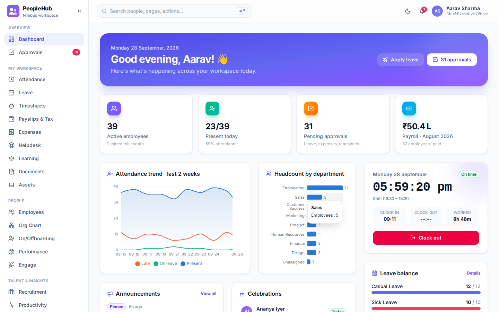

| Dark mode | Mobile |
| --- | --- |
| 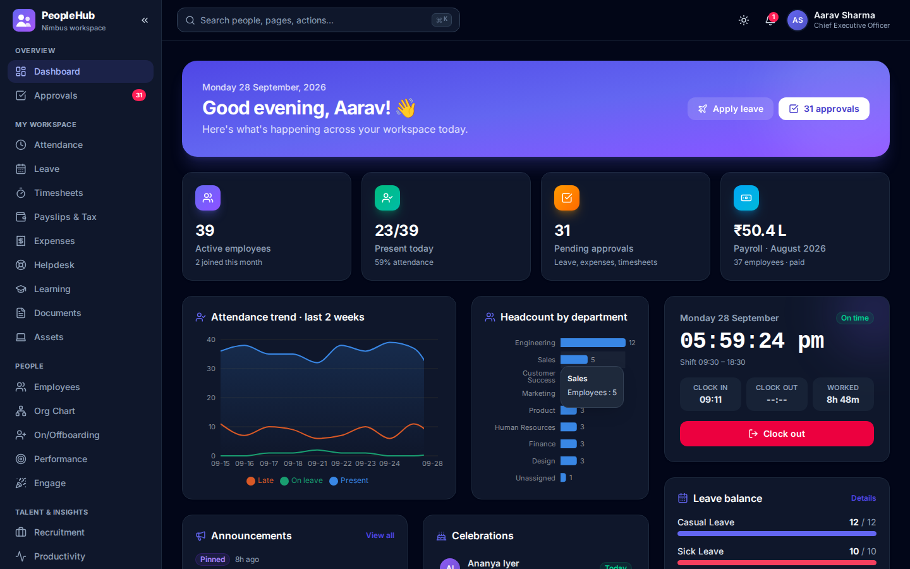 | 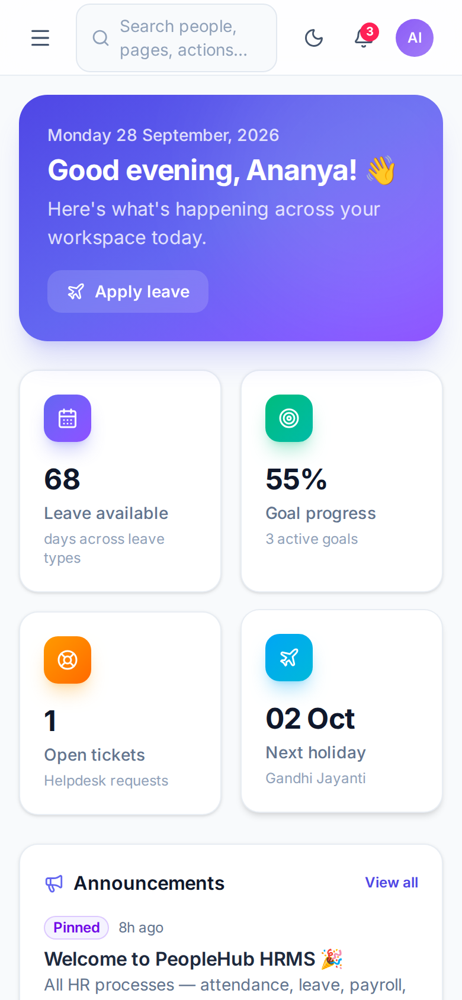 |

## Modules

| Area | Features |
| --- | --- |
| **Dashboard** | Role-aware KPIs, attendance trend, headcount by department, live clock-in widget, leave balances, who's out, celebrations (birthdays & work anniversaries), new joiners, announcements, kudos, upcoming holidays |
| **Core HR** | Employee directory (table & card views, filters, CSV export), rich profiles, interactive org chart, multiple legal entities (companies), custom profile fields, CSV bulk import with dry-run validation, probation confirmation/extension, HR edit/reset password/offboard |
| **Policies** | Keka-style assignable plans with an organisation default: leave plans (quotas, yearly/monthly accrual, pro-rating, carry forward, encashment, notice, max run, probation, sandwich and gender rules), holiday lists per state/office, weekly-off patterns (e.g. 2nd & 4th Saturday), attendance policies (clock-in modes, geofence, grace, full/half-day hours, regularisation limits, overtime) with monthly late-mark penalties and waivers, and expense policies (limits, mileage, per diem, receipts); bulk assignment to employees |
| **Attendance** | Biometric and card terminals (ZKTeco / eSSL iclock push or JSON API) with first-in / last-out processing and unmatched-ID mapping, office clock-in limited to office IP ranges, automatic clock-out, clock in/out with office/remote/field mode and geo-fencing (off / flag / enforce), shift-based late marks, half days and overtime, weekly shift roster, WFH / on-duty / comp-off / overtime requests, regularization, monthly calendar, team presence board |
| **Leave** | Configurable leave types & quotas, live balances, weekend & holiday-aware day counting, half days, overlap and balance validation, approvals, cancellation, optional holidays with a yearly quota, year-end carry forward with cap, team calendar |
| **Payroll** | Per-company monthly payroll runs using attendance + LOP, salary templates (components as % of CTC, % of Basic, fixed or balancing; custom deductions; employer PF and gratuity inside or outside CTC; PF wage cap, ESI and PT per template) with a live breakup preview, assigned per employee or department, component-wise payslips with employer contributions, statutory deductions (PF, ESI, PT, TDS under old or new regime), tax planner comparing regimes, investment declarations, annual tax statement, loans & salary advances with EMI deduction, expense reimbursement through payroll, bank transfer file, printable payslips |
| **Expenses** | Reimbursement claims validated against the employee's expense policy (categories, per-claim and monthly limits, mileage and per-diem pricing, receipts required above an amount), receipt uploads (PDF/photo) viewable by the approver from the inbox, manager approval/rejection with comments |
| **Timesheets & projects** | Weekly timesheet grid, billable utilisation, project budgets vs logged hours, approvals |
| **Professional services** | Clients and contacts, projects with billing types, member rates, milestones, budget burn and margin, opportunity pipeline with convert-to-project, resource planner (allocation, utilisation, bench), invoices from billable time or milestones with GST, PDF, email, payments, receivables ageing and project P&L |
| **Recruitment (ATS)** | Public careers page with online applications, job openings, drag-and-drop candidate kanban, resume uploads, interview scheduling with email invitations, PDF offer letters emailed to candidates, one-click hire → employee + onboarding checklist |
| **On/offboarding & exit** | Pre-boarding portal for new hires (details, documents, offer e-signature) with HR verification and one-click conversion to an employee, checklist templates per department with owners and day offsets, onboarding buddy, My onboarding page, auto-generated checklists, resignations with notice-period LWD and manager → HR approval, exit interviews with analytics, full & final settlement (salary, EL encashment, gratuity, notice and loan recovery) |
| **Performance** | Goals/OKRs, self → manager reviews, review cycles, continuous feedback with visibility control, 360° feedback requests, one-on-ones with agenda, notes and action items |
| **Engage** | Announcements, social feed (likes, comments, @mentions), kudos wall, pulse polls, anonymous eNPS with score and breakdown |
| **Productivity** | We360-style: a native desktop agent for Windows and macOS ([agent/README.md](agent/README.md)) with a tray icon (status, pause/resume), one-line installers, device tokens, live active/idle/offline board, per-person hourly timeline, apps & websites, screenshots (opt-in), app classification rules with department overrides, alerts (long idle, unproductive, overwork), auto clock-in |
| **Work** | Task kanban across projects, travel requests with advances, unified company calendar |
| **Learning** | Course catalogue, mandatory compliance training, enrolment & progress, completion tracking |
| **Helpdesk** | Tickets with priority, assignment, status workflow and attachments; knowledge base with search, helpful votes and article suggestions while raising a ticket |
| **Assets** | Inventory with warranty and condition, assignment with employee acknowledgement, returns (damaged → repair, lost → retired), full history, employee asset requests with approval, returns due from leavers and recovery in full & final settlement |
| **ID card** | Profile photo, printable digital ID card with a QR code that opens a public verification page, PNG download, print / save as PDF, and batch printing for HR |
| **Documents** | Company documents in folders with audience targeting (department, location, entity), version history with re-acknowledgement, review and expiry dates; policy acknowledgement tracking with reminders; employee document checklist with HR verification and expiry reminders; letter templates, PDF letters, bulk letters and electronic signatures; employee letter requests |
| **Approvals inbox** | Unified queue for leave, attendance, WFH/on-duty, expenses, travel, loans, timesheets, resignations and tax proofs; configurable manager / manager → HR / HR flows with a full decision history; bulk approve |
| **Reports** | Headcount trend, attrition, diversity, attendance, leave utilisation, payroll cost, hiring funnel & sources — every dataset exportable to CSV |
| **Analytics & export** | Cross-module analytics over 3/6/12 months (headcount, joiners and exits, annualised attrition, tenure, attendance, billable utilisation, pipeline, eNPS; revenue vs payroll cost for HR), a workload & wellbeing view (long days, days off worked, late nights, time since last leave, team comparison) and a bulk export centre for 17 datasets to Excel or CSV with filters, column picking and an export log |
| **Admin** | Departments, designations, locations, shifts, leave policy, holidays, company settings, full audit log |
| **Email** | Transactional email over SMTP: every in-app notification is also emailed (per-user opt-out), plus welcome emails with sign-in details, interview invitations, a forgot-password flow with single-use reset links, and password-change alerts. Emails go through a persistent outbox with background delivery and retries; admins get delivery status, a rendered preview, a test send and an SMTP connection check in Settings → Email |
| **Notifications** | Every module (leave, attendance, approvals, payroll, expenses, hiring, onboarding, documents and letters, assets, performance, helpdesk, exits, biometric devices, monitoring alerts, security events) notifies through one channel. Each notification appears in the bell, as a live toast while the user is on the site, in the tab title and app badge, and as a browser/phone push notification (Web Push with VAPID) even when PeopleHub is closed. Clicking opens the right page and marks it read. Per-device opt-in, test send, device list, plus email |
| **Platform** | Notifications centre, ⌘K command palette (people, pages, quick actions), dark mode, responsive mobile layout, role-based access (Admin, HR, Manager, Employee) enforced in UI and API |

## Architecture

```
client/  React 19 SPA · Redux Toolkit + RTK Query · React Router · Tailwind CSS v4 · Recharts · TanStack Virtual
server/  Node.js + Express 5 · SQLite (built-in node:sqlite, zero native deps) · JWT auth · bcrypt · Multer uploads · Nodemailer SMTP
agent/   Desktop activity agent for Windows & macOS (Go, standard library only)
e2e/     Playwright end-to-end tests (76 tests across all modules and roles, with a real SMTP capture server)
```

**SPA & performance**

- **Pure single-page app**: client-side routing only; navigating between modules never reloads the document (verified by an E2E test).
- **Code splitting**: every page is a lazy chunk, and vendor code is split into long-cacheable `react`, `state`, `charts` and `icons` chunks. Hovering a sidebar item prefetches that page's chunk.
- **Skeleton loaders** for every page, card and table instead of spinners.
- **RTK Query cache**: deduplicated requests, a shared cache across pages, and tag-based invalidation. Writes refresh every dependent module automatically, e.g. approving leave refreshes attendance, balances, approvals and the dashboard.
- **Installable PWA**: web manifest and a service worker that caches the app shell and hashed assets (API calls are never cached).
- **Large datasets**: the `DataTable` is virtualised and renders only visible rows, so 5,000+ records scroll smoothly (covered by an E2E test). It also has debounced search, multi-type sorting and CSV export.

## Going live

To deploy on your own cloud VM (AWS, Azure, Google Cloud, DigitalOcean, …) with HTTPS, email, backups and one-command
updates, follow **[docs/DEPLOYMENT.md](docs/DEPLOYMENT.md)**. It covers Docker (recommended) and a direct install.
In production the first start creates your organisation and administrator from `.env`, not demo data.

## Getting started

Requires **Node.js 22.9+** (uses the built-in `node:sqlite` and `--env-file-if-exists`).

```bash
npm install
npm run build        # build the SPA
npm start            # API + SPA on http://localhost:4000 (seeds demo data on first run)
```

Development with hot reload (API on :4000, Vite on :5173 with proxy):

```bash
npm run dev
```

Reset demo data at any time: `npm run seed`.

Desktop activity agent for Windows and macOS (needs Go 1.24+ to build; see [agent/README.md](agent/README.md)):

```bash
npm run agent:build   # builds agent/dist; PeopleHub then offers downloads and one-line installers in Productivity → Devices
npm run agent:test
```

Or simulate agents without installing anything (registers devices and streams heartbeats and screenshots):

```bash
npm run agent:simulate -- --people 5 --minutes 60 --live
```

### Demo accounts

All passwords are `Password@123`, and the login screen has one-click buttons for each role.

| Role | Email |
| --- | --- |
| Admin | admin@peoplehub.demo |
| HR | hr@peoplehub.demo |
| Manager | manager@peoplehub.demo |
| Employee | employee@peoplehub.demo |

### Configuration

| Variable | Default | Purpose |
| --- | --- | --- |
| `PORT` | `4000` | HTTP port |
| `DB_PATH` | `server/data/hrms.db` | SQLite database file |
| `JWT_SECRET` | dev secret | **Set in production** |
| `RESET_DB` | – | `1` reseeds demo data on start (destroys existing data) |
| `NODE_ENV` | – | `production` requires `JWT_SECRET` and creates a clean organisation on first start |
| `ADMIN_EMAIL` / `ADMIN_PASSWORD` | – | First production start: the administrator account |
| `SEED_DEMO` | – | `1` loads demo data even in production (demo servers only) |
| `TRUST_PROXY` | – | `1` behind Nginx/Caddy |
| `APP_URL` | `http://localhost:$PORT` | Public URL used for links in emails |
| `UPLOAD_DIR` | `server/data/uploads` | Where uploaded files are stored (keep it outside the web root and back it up) |
| `MAX_UPLOAD_MB` | `10` | Maximum upload size |
| `SMTP_HOST` | – | SMTP server. Unset = emails are recorded in the outbox but not sent |
| `SMTP_PORT` | `587` | `465` enables implicit TLS automatically |
| `SMTP_USER` / `SMTP_PASS` | – | SMTP credentials |
| `SMTP_FROM` | company HR address | e.g. `"Acme HR <hr@acme.com>"` (keep the quotes) |
| `SMTP_SECURE` | auto | Force TLS on/off (`true`/`false`) |

Copy `.env.example` for a starting point. SMTP works with any provider (Gmail/Google Workspace app passwords, Microsoft 365, Amazon SES, SendGrid, Mailgun, Zoho Mail, Postmark and others).

### File uploads & security

- Files are stored under random names outside the public web root and are only served through an authenticated endpoint that re-checks permissions on every download.
- Each record type has its own access rules. Examples: expense receipts are visible to the claimant, their management chain and HR; personal documents only to the owner and HR.
- Uploads are validated three ways: allow-listed extension, declared MIME type, and file signature (magic bytes). Size is limited, rejected uploads are deleted immediately, and deleting a record deletes its files.
- Downloads are sent with `nosniff`, a restrictive CSP and `Content-Disposition`. Only images and PDFs may render inline.

## Testing

```bash
npm run test:api     # backend: payroll/tax maths, leave rules, RBAC, audit, uploads, SMTP delivery (node:test)
npm run test:e2e     # builds the SPA and runs the Playwright suite in Chromium
```

The E2E suite drives the real app in a browser and covers authentication, SPA behaviour, skeletons, RBAC, the command palette, dark mode, clock-in/out, regularization, leave apply/approve/reject/cancel with balance checks, employee CRUD, onboarding, org chart, virtualised 5,000-row tables, payroll run → paid → payslip, salary revision, tax declarations, recruitment pipeline (including drag-and-drop), hiring, goals, reviews, expenses, bulk approvals, timesheets, helpdesk, announcements, kudos, polls, learning, documents, notifications (live toasts, push opt-in), organization setup, settings, offboarding, reports, productivity, audit log, the mobile layout, file uploads (documents, receipts, ticket attachments, resumes, previews, downloads, type validation) email (welcome, approval and reset emails delivered to a real SMTP server, the email log and preview, test sends, forgot-password via the emailed link, opting out), and the parity features: two-level approvals, WFH requests, optional holidays, shift roster, tax planner and statement, bank file, letter PDFs emailed as attachments, policy acknowledgement, CSV import, knowledge base, feedback and 1:1s, social feed, eNPS, public careers applications and offer letters, tasks, travel, calendar, full & final settlement, resignation → exit interview, the activity agent (device token → live board → timeline → revocation), professional services (clients, opportunities, projects, resources, invoicing), bulk export and analytics, and policies (leave plan rules, plan copy and assignment, weekly-off patterns, state holiday lists, mileage expense claims, attendance clock-in modes, late-mark penalties).

## Screenshots

| | |
| --- | --- |
| 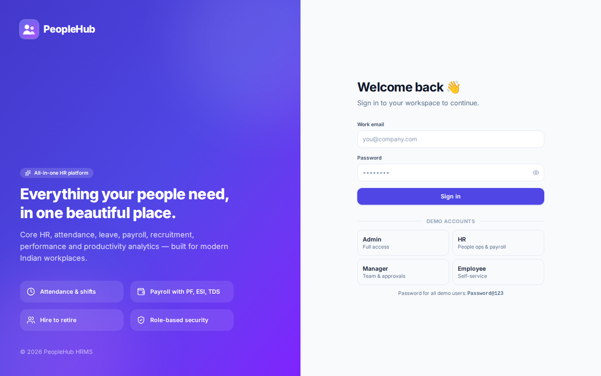 | 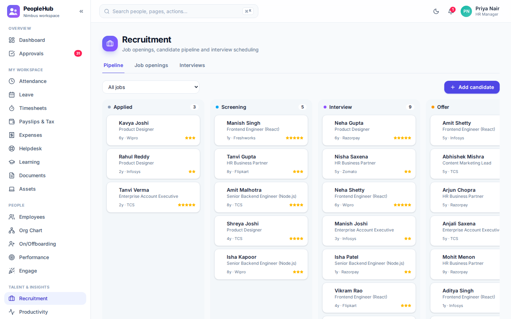 |
| 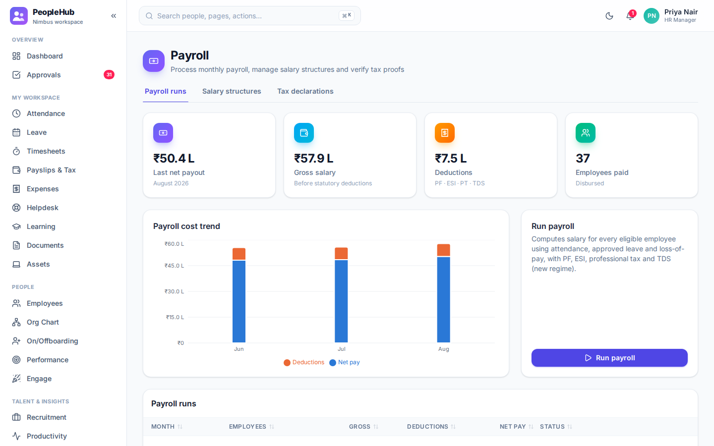 | 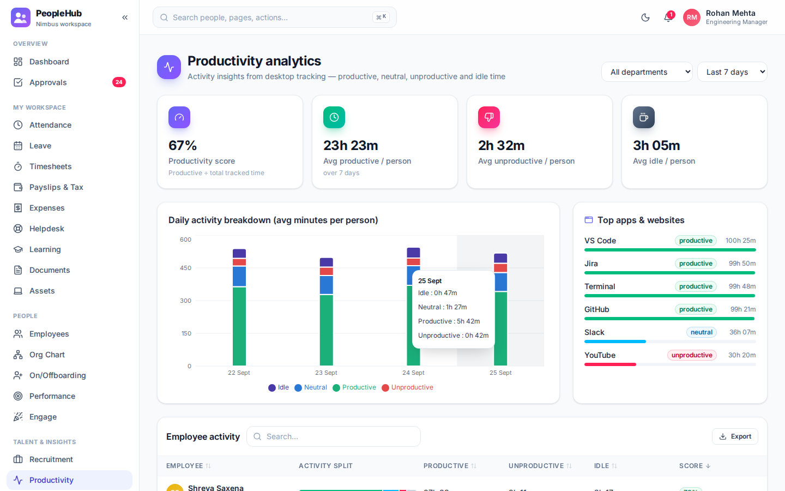 |
| 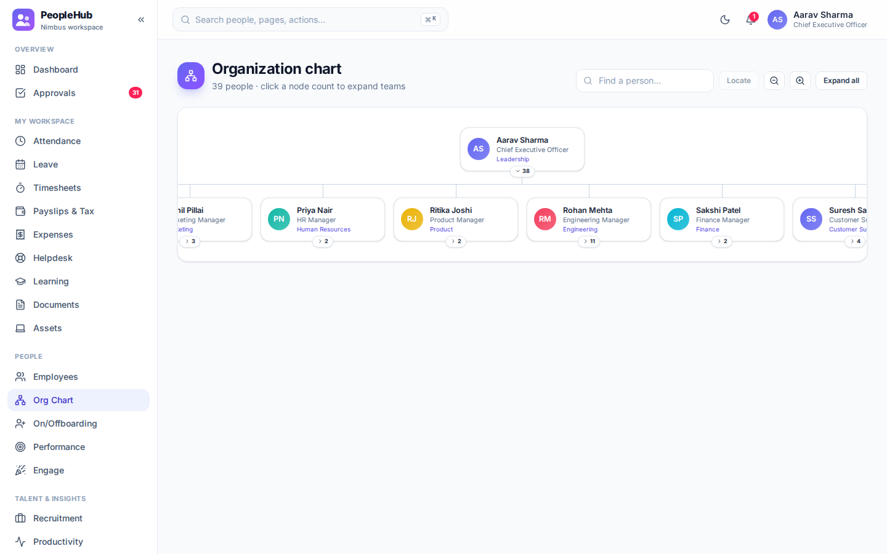 | 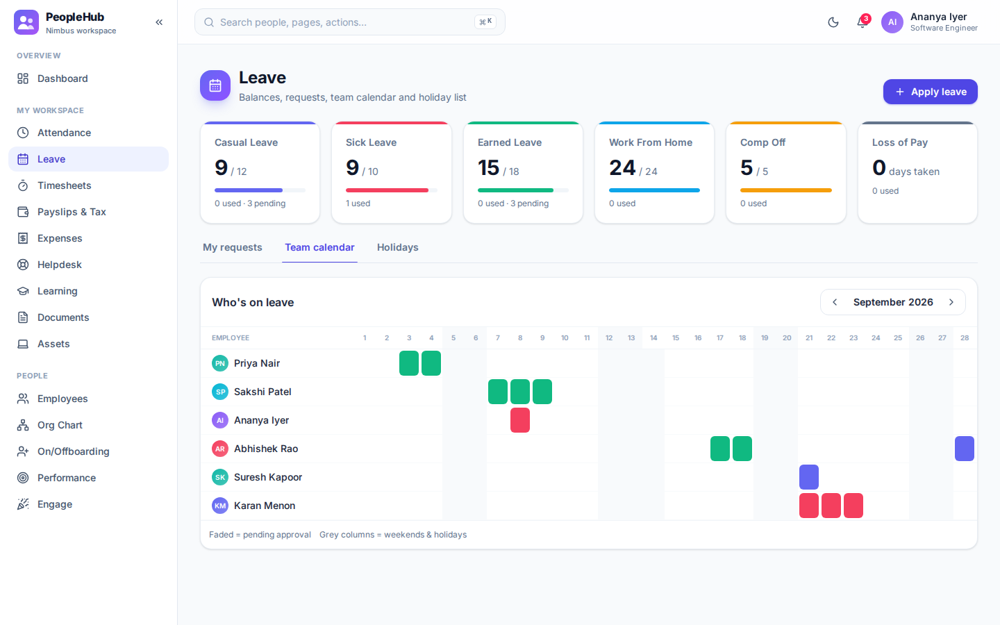 |
| 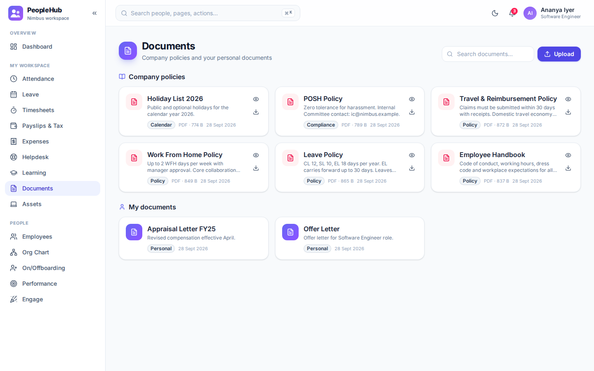 | 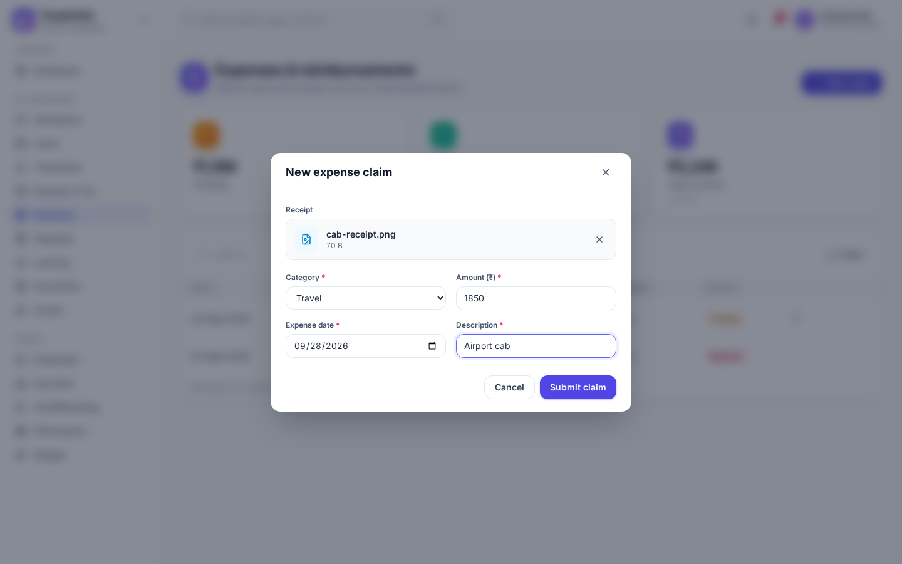 |
| 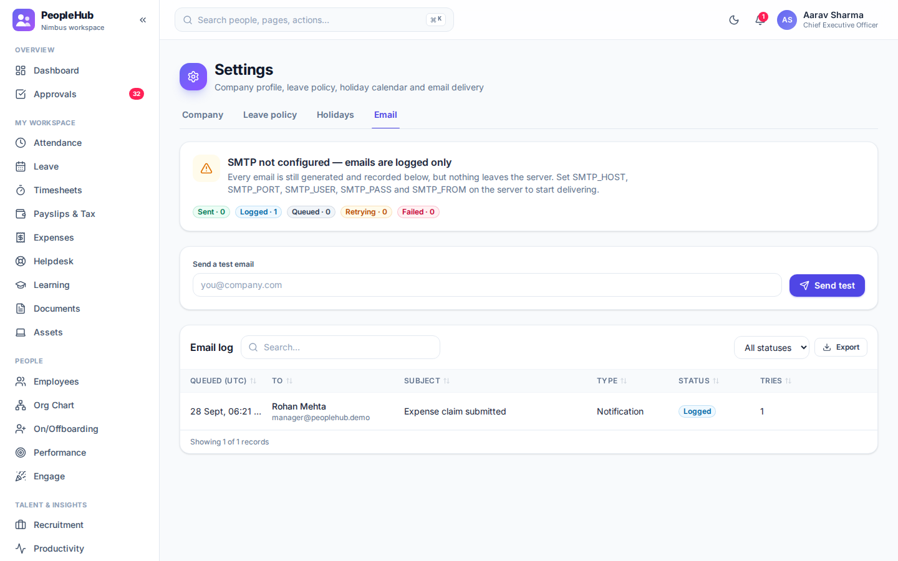 | 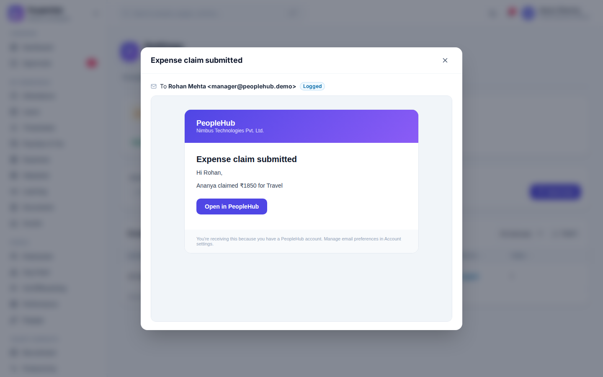 |
